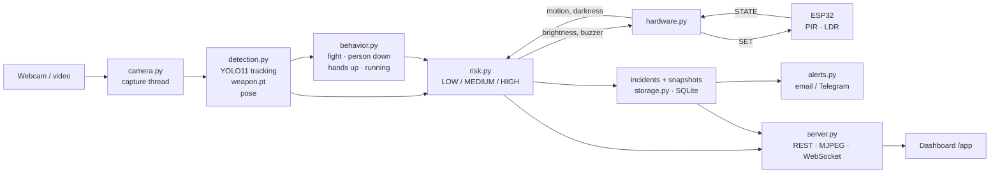

# Sentinel Street — Guide

This guide explains what was built on top of the original prototype, how to start it, and how it
works inside. Read it top to bottom once; after that, jump to the section you need.

1. [What changed from the prototype](#1-what-changed-from-the-prototype)
2. [Start it](#2-start-it)
3. [Using the dashboard](#3-using-the-dashboard)
4. [How it works](#4-how-it-works)
5. [The AI models](#5-the-ai-models)
6. [Hardware: the ESP32 street light](#6-hardware-the-esp32-street-light)
7. [Alerts (email / Telegram)](#7-alerts-email--telegram)
8. [Settings you will actually change](#8-settings-you-will-actually-change)
9. [Troubleshooting](#9-troubleshooting)
10. [For developers](#10-for-developers)
11. [What is not done yet](#11-what-is-not-done-yet)

---

## 1. What changed from the prototype

The original `smart_street_light.py` was a Tkinter window that drew a screenshot of a dashboard,
showed the webcam, and ran YOLO for knives. It needed image files that were not in the repo
(`assets/`), had no risk levels, no ESP32 code, and most tabs were placeholders.

It has been rebuilt into a working system:

| Before | Now |
|---|---|
| Tkinter window, fixed-size artwork | Web dashboard at `/app` (works in any browser, also on a phone) plus a 3D landing page at `/` |
| Knife / scissors only, weapon model not in the repo | **Your trained `weapon.pt`** (guns, rifles, knives, blunt objects) + people/vehicle tracking + body pose |
| A "risk score" number | **LOW / MEDIUM / HIGH** with reasons, driving the lamp and buzzer |
| No crime behaviour | Possible fight, person down, hands raised near someone, people running |
| Video froze while the AI ran | AI runs on its own thread; the video stays smooth |
| Nothing saved | Incidents with snapshot, notes, review status, PDF/CSV reports, analytics |
| Placeholder tabs | All 9 tabs work: Overview, Live monitoring, Incidents, GPS, Alert contacts, Sensors & lights, Analytics, Reports, Settings |
| No ESP32 code | `firmware/esp32_street_light/esp32_street_light.ino` with a serial protocol and a stand-alone fail-safe |
| No tests | 49 automated tests |

`smart_street_light.py` and `test_yolo.py` were removed; `run.py` is the new entry point.

---

## 2. Start it

### First time

You need **Python 3.10, 3.11 or 3.12** (3.13+ may not have PyTorch wheels yet).

```bash
# macOS / Linux
python3 -m venv .venv
.venv/bin/pip install -r requirements.txt
```

```powershell
# Windows (PowerShell)
py -3.12 -m venv .venv
.venv\Scripts\pip install -r requirements.txt
```

This installs PyTorch, Ultralytics, OpenCV, FastAPI and the rest (a few minutes; ~1 GB).

### Every time

```bash
.venv/bin/python run.py            # macOS / Linux
.venv\Scripts\python run.py        # Windows
```

1. The browser opens **http://127.0.0.1:8000** (the landing page).
2. Click **Open control room**, or go straight to **http://127.0.0.1:8000/app**.
3. Wait for **System ready** (bottom-left). The first start loads the AI models (~10 s).
4. Go to **Live monitoring** and press **Start camera**.

Stop it with **Ctrl+C** in the terminal.

**macOS:** start it from **Terminal.app** (or iTerm). The first time, macOS asks to allow the camera
for Terminal: click **Allow**. If you clicked *Don't allow*, turn it on in *System Settings → Privacy &
Security → Camera* and start again.

### Without a webcam (demo mode)

```bash
.venv/bin/python run.py --video some-street-video.mp4
```

The video (or a single image) loops as if it were the camera. Good for presentations.

### Options

| Option | Meaning |
|---|---|
| `--no-browser` | don't open a browser window |
| `--port 9000` | use another port |
| `--video FILE` | play a file instead of the webcam |

The server listens on `127.0.0.1` only, so nobody else on the network can see the camera.

---

## 3. Using the dashboard

| Tab | What you do there |
|---|---|
| **Overview** | The big panel shows the current risk (LOW/MEDIUM/HIGH), why, the lamp and buzzer state, and plays *example* detections. The live camera is not shown here. Below: "Why this level", the activity log, and recent incidents. |
| **Live monitoring** | The live camera with AI boxes, track IDs and pose skeletons. Right side: which models are running, speed, confidence sliders, and everything in view (each with the model that found it, e.g. `weapon.pt`). With the camera off it replays your own recent detections. |
| **Incident review** | Every MEDIUM/HIGH moment with its snapshot. Open one to read the reasons, add notes, mark it **Reviewed** or **False alarm**, send the alert, or delete it. |
| **GPS tracking** | Set where this street light is: *Use my location*, *Pick on map*, or type coordinates. Incidents appear on the map. |
| **Alert contacts** | Add people to alert (email or Telegram), test them, and choose *Operator confirms* (default) or *Automatic*. |
| **Sensors & lights** | Connect the ESP32 (pick its USB port), see PIR/LDR readings and what the lamp is doing, and test the lamp and buzzer by hand. |
| **Analytics** | Incidents per day and hour, what was detected, false-alarm rate, people/vehicle counts over 24 h. |
| **Reports** | Download a PDF (summary, log, evidence photos) or CSV for a date range. |
| **Settings** | Time zone, AI model and thresholds, risk rules, night hours, lamp dim level, alert cooldowns, how long evidence is kept. |

Mark false alarms in Incident review: it keeps the analytics honest and the replay reels clean.

---

## 4. How it works



**The loop** (`sentinel/service.py`) runs about 4 times a second:

1. Take the newest camera frame.
2. **Detect** (`detection.py`): YOLO11 finds people and vehicles and gives each person a tracking ID;
   `weapon.pt` finds weapons; the pose model adds 17 body points to each person.
3. **Behaviour** (`behavior.py`): looks at the last few seconds of each tracked person and flags
   crime cues (rules below).
4. **Risk** (`risk.py`): combines detections, behaviour, night/day and PIR motion into LOW / MEDIUM / HIGH.
5. **Respond**: sends `SET <brightness> <buzzer>` to the ESP32 (`hardware.py`); when risk goes up, saves
   an incident with a snapshot (`storage.py`) and, for HIGH, prepares an alert (`alerts.py`).
6. The dashboard gets the new state over a WebSocket every 0.4 s and the video as an MJPEG stream.

### The risk rules

**HIGH** (lamp 100 %, buzzer on, incident + alert):
- a **weapon** seen in at least **2 of the last 3** detection passes (one flickering frame is not enough), or
- a sustained crime cue: **possible fight**, **person down**, **hands raised near another person**.

HIGH is held for 8 s after the cause disappears so the lamp and buzzer don't flicker.

**MEDIUM** (lamp 100 %, incident):
- a person or PIR motion **at night**,
- a **crowd** (6+ people by default),
- one person **lingering** at night for 60 s+ (timed per tracked person),
- **two or more people running**.

**LOW**: street clear. Lamp at 20 % at night, off by day.

Night comes from the **LDR** sensor when the ESP32 is connected, otherwise from the clock (18:30–06:00 by default).

### The crime-behaviour rules (`sentinel/behavior.py`)

These are transparent rules on body pose, not a trained "crime" model, so each is labelled *possible*
and must last a moment before it counts. Distances and speeds are measured in body heights, so they
work near or far from the camera.

| Cue | Rule | Level |
|---|---|---|
| Person down | whole torso visible and horizontal for 2 s (people cut off by the frame edge are ignored) | HIGH |
| Hands raised near someone | both wrists above the head for 1.5 s with another person within 2 body heights | HIGH |
| Possible fight | two people within ~1 body height and at least 3 fast arm strikes in 1.5 s | HIGH |
| People running | 2+ people moving faster than 1.6 body heights per second for 1 s | MEDIUM |

Alerts wait for an operator by default because these rules (and any weapon model) can be wrong.

---

## 5. The AI models

| File | What | Notes |
|---|---|---|
| `models/custom/weapon.pt` | **Your trained model**: YOLO26s, classes `person`, `weapon`, 416 px | runs at the size it was trained at |
| `yolo11n.pt` | COCO model: people, vehicles (+ knife/scissors/bat) with tracking | switch size in Settings → AI model |
| `yolo11n-pose.pt` | body keypoints for the behaviour rules | turn off in Settings → Crime behaviour analysis |

### How good is the weapon model?

Measured on the **684 test images** of its dataset (the zip "Yolo Weapon Detection.v1i.yolo26"),
with the 9 dataset classes merged into `person` / `weapon`:

| Class | Precision | Recall | mAP50 | mAP50-95 |
|---|---|---|---|---|
| weapon | 0.82 | 0.63 | 0.69 | 0.32 |
| person | 0.90 | 0.82 | 0.87 | 0.51 |

The training log shows mAP50 0.88; on this held-out test split the weapon class scores 0.69.

What matters for a camera is *per frame*. With the weapon threshold at **0.55** (the default):
**72 %** of frames with a weapon are caught and **4.9 %** of weapon-free frames give a false alarm.
Because HIGH needs a weapon in 2 of 3 passes, false HIGH alarms drop to about **0.7 %**.

| Threshold | Weapon frames caught | False alarms |
|---|---|---|
| 0.45 | 78 % | 9.3 % |
| **0.55** | **72 %** | **4.9 %** |
| 0.65 | 58 % | 2.2 % |

All three models together run at about 90–120 ms per frame on an Apple M1 Pro (GPU). On a laptop
without a GPU expect it to be slower; raise *Detection interval* in Settings if the CPU is busy.

**Real-world limits:** the dataset is mostly close, clear photos. Expect best results within a few
metres; small or hidden knives at a distance and dark scenes are harder. A better camera helps more
than anything else.

### Improve or replace the model

1. Train with Ultralytics as before (`yolo detect train data=... model=yolo26s.pt imgsz=416`).
2. Copy the new `best.pt` into `models/custom/` (any name ending in `.pt`).
3. Restart. It loads automatically; Live monitoring shows its name next to its detections.

Classes are matched **by name**: `gun`, `pistol`, `rifle`, `knife`, `weapon`, `blunt`… become
weapons; `fight`, `violence`, `robbery`, `assault`, `theft`… become crime events (HIGH after 2 of 3
frames); anything else (like `person`) is ignored. So a model trained with a `fight` class plugs in
without code changes. Ideas that would help most: more night / CCTV-angle images, more far-away
small weapons, and hard negatives (phones, umbrellas, tools) labelled as background.

---

## 6. Hardware: the ESP32 street light

Sketch: [`firmware/esp32_street_light/esp32_street_light.ino`](firmware/esp32_street_light/esp32_street_light.ino)

| Part | ESP32 pin | Notes |
|---|---|---|
| Street light LED | GPIO 25 | PWM dimming; use a transistor/MOSFET for anything brighter than one LED |
| Piezo buzzer | GPIO 26 | |
| PIR sensor (HC-SR501) OUT | GPIO 27 | power the PIR from 5 V; its output is 3.3 V-safe |
| LDR | GPIO 34 | LDR to 3.3 V, 10 kΩ to GND; brighter = higher reading |

**Flash it:** Arduino IDE → Boards Manager → install *esp32 by Espressif* (core **3.x**) → board
*ESP32 Dev Module* → upload. (On core 2.x, replace `ledcAttach` with the two lines in the comment.)

**Connect it:** plug the ESP32 in by USB → dashboard → **Sensors & lights** → pick the port (USB serial
adapters are marked ★) → **Connect**. Within a second it shows *Online* with live PIR and LDR values.
Use **Manual test** to check the lamp and buzzer.

**Protocol** (115200 baud, one line per message):

| Direction | Message | Meaning |
|---|---|---|
| PC → ESP32 | `SET 100 1` | lamp brightness % and buzzer on/off (sent on change and every 1 s) |
| PC → ESP32 | `CFG 1500 20` | LDR dark threshold and stand-alone dim % (from Settings) |
| ESP32 → PC | `STATE 1 812 100 1` | PIR, LDR (0–4095), current brightness, buzzer (every 0.5 s) |
| ESP32 → PC | `READY sentinel-esp32 v1` | after boot |

**Fail-safe:** if the PC stops talking for 5 s, the ESP32 runs on its own: dark + motion → 100 %,
dark → dim, daylight → off. If the USB cable is unplugged and plugged back, the app reconnects by itself.

No ESP32? The app runs a **simulator**, so everything else works.

---

## 7. Alerts (email / Telegram)

Alerts are off until you set them up.

1. Copy `.env.example` to `.env` (this file is git-ignored; never commit it).
2. Fill in one or both:
   - **Email (Gmail):** turn on 2-Step Verification, create an [App Password](https://myaccount.google.com/apppasswords),
     and set `SMTP_HOST=smtp.gmail.com`, `SMTP_PORT=465`, `SMTP_USER`, `SMTP_PASSWORD`.
   - **Telegram:** create a bot with **@BotFather** and put its token in `TELEGRAM_BOT_TOKEN`. Each
     person presses **Start** on the bot once; their numeric chat ID comes from **@userinfobot**.
3. Restart → **Alert contacts** → add contacts → **Test**.

**Operator confirms** (default): a HIGH incident waits in Incident review; one click sends it with the
snapshot and a Google Maps link. **Automatic**: sends at once, limited by *Auto-alert cooldown*.

---

## 8. Settings you will actually change

| Setting | Default | Why change it |
|---|---|---|
| Weapon confidence | 0.55 | lower = catches more, more false alarms (see the table in section 5) |
| AI model | YOLO11 nano | *small* is more accurate, a bit slower (downloads 19 MB once) |
| Crime behaviour analysis | on | turn off if the camera faces a busy area and cues misfire |
| Night starts / ends | 18:30 / 06:00 | match local sunset/sunrise if there is no LDR |
| Night brightness when quiet | 20 % | energy saving vs visibility |
| Lingering after | 60 s | how long someone can stay at night before MEDIUM |
| Keep evidence for | 30 days | older incidents and snapshots are deleted automatically |

---

## 9. Troubleshooting

| Problem | Fix |
|---|---|
| "No camera delivered a frame" | Close other apps using the camera (Zoom, FaceTime, Teams). On macOS allow camera for Terminal and run from Terminal.app. Try **Switch** for a USB webcam. |
| Camera works but no boxes | Wait for *System ready*; check Live monitoring → AI detector shows the models. |
| Too many false weapon alarms | Raise Weapon confidence to 0.6–0.65; mark false alarms; consider retraining with hard negatives. |
| "Person down" / "fight" misfires | Turn off Crime behaviour analysis in Settings for that camera position. |
| `Address already in use` | Another copy is running. Stop it, or use `--port 9000`. |
| Very slow on Windows/Linux without GPU | Raise Detection interval (e.g. 500 ms) or turn off behaviour analysis. With an NVIDIA GPU, install the CUDA build of PyTorch. |
| ESP32 port missing | Install the USB driver (CP210x or CH340), use a data USB cable, press refresh. |
| Map is blank | The map tiles need internet; you can still type coordinates. |

---

## 10. For developers

```
sentinel/
  config.py      paths, .env, default settings
  camera.py      webcam / video capture thread (one reader per session)
  detection.py   YOLO tracking + custom models + pose; draws boxes and skeletons
  behavior.py    crime cues from tracked poses
  risk.py        LOW / MEDIUM / HIGH and the lamp/buzzer response
  service.py     the main loop that ties everything together
  hardware.py    ESP32 serial link + simulator
  alerts.py      email / Telegram
  storage.py     SQLite: incidents, contacts, metrics, settings (data/sentinel.db)
  reports.py     PDF / CSV
  server.py      FastAPI: REST API, /api/stream (MJPEG), /ws (live state)
web/
  index.html, app.js, app.css     dashboard (/app)
  landing.html, landing.js, ...   landing page (/) with the three.js scene
  theme.css                       shared colours and fonts
```

**Tests:**

```bash
.venv/bin/pip install -r requirements-dev.txt
.venv/bin/python -m pytest
```

Tests use a temporary data folder (`SENTINEL_DATA_DIR`) and never touch `data/`.

**Data** lives in `data/` (git-ignored): `sentinel.db` and `evidence/*.jpg`. Delete the folder to start fresh.

**API:** open http://127.0.0.1:8000/docs for the interactive API reference.

---

## 11. What is not done yet

- **Real ESP32:** the firmware and protocol are written and the simulator works, but no physical board
  has been connected yet. First test: flash, connect, run Manual test.
- **Email / Telegram:** the code is in place; delivery needs real credentials in `.env` to verify.
- **Behaviour rules on real footage:** tested with synthetic poses and a live webcam; tune the
  thresholds in `sentinel/behavior.py` with a few real clips (a scuffle, someone lying down).
- **Weapon model:** retraining with night/CCTV images and hard negatives would raise recall and cut
  false alarms (see section 5).
